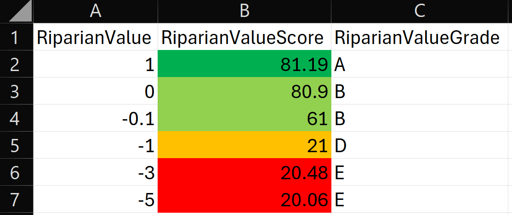
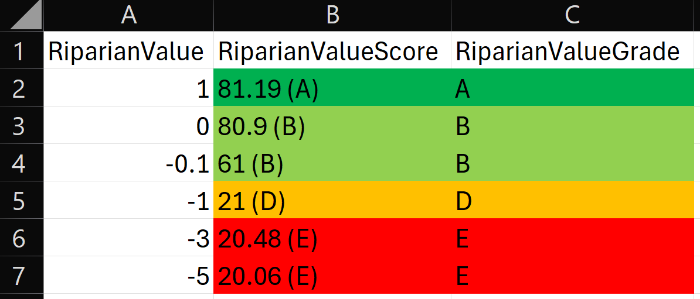
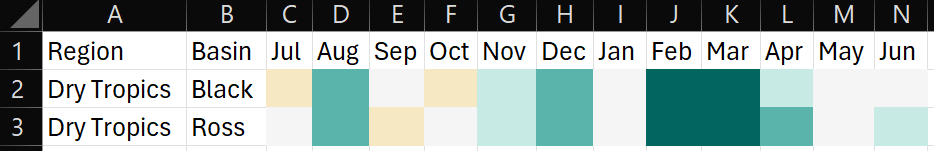
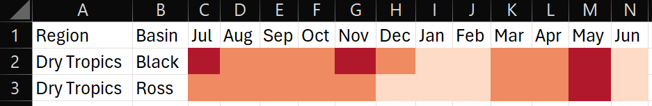
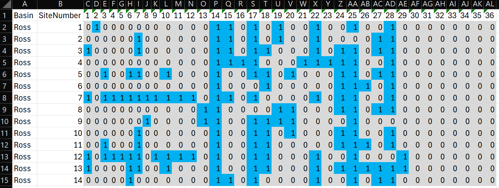

<!-- README.md is generated from README.Rmd. Please edit that file -->

```{r, include = FALSE}
knitr::opts_chunk$set(
  collapse = TRUE,
  comment = "#>",
  fig.path = "man/figures/README-",
  out.width = "100%"
)
```

# RcTools

<!-- badges: start -->
<!-- badges: end -->

The goal of RcTools is to provide a collection of tools (functions) to be utilised by the Northern Three Report Cards' technical staff. These tools bridge the gap between R analysis and technical report writing, and primarily focus on end of anaylsis pipelines such as converting values to scores, score to grades, and dataframes into xlsx files that are pre-formatted ready to be inserted into the technical report.

## Installation

To install this package you will first need to download the [RTools package](https://cran.r-project.org/bin/windows/Rtools/rtools45/rtools.html) and install it on your computer (accept the defaults everywhere during the installation process).

Following this, you can install the development version of RcTools from [GitHub](https://github.com/) with:

```{r}
#| eval: FALSE

# install.packages("pak")
pak::pak("add-am/RcTools")

```

Finally, load the package just like you would any other R package:

```{R}
#| eval: FALSE

library(RcTools)

```

## Usage

This package currently offers 3 key functions; `value_to_score()`, `score_to_grade()`, and `save_n3_table()`. Each of these functions are designed to work in sequence, starting from calculating report card scores, and finishing with saving an .xslx table. A summary of each function and an example use case is provided below. Alternatively, function documentation can be accessed with the command `?value_to_score` etc.

### value_to_score

The `value_to_score()` function is designed to calculate a variety of report card scores used by the Northern Three Report Cards. The function takes a dataframe and appends an additional column to the dataframe with the calculated scores.

Currently this function can score the following indices/indicators:

 - All water quality indicators (freshwater, estuarine, and marine environments)
 - Mangroves and saltmarsh
 - Wetlands
 - Riparian vegtation (freshwater and estuarine)
 - Fish

Depending on the index/indicator a different amount of inputs are requried. Below is a example of how to use the `value_to_score()` function to calculate scores for water quality indicators in the freshwater environment.

First you would need to have a table of data:

```{r v2s example 1}
#| eval: FALSE

#load the package
library(RcTools)

#create an example dataframe
df <- data.frame(
  WQIndicator = c(rep("DIN", 3), rep("Low DO", 3)),
  WQObjective = c(rep(0.02, 3), rep(90, 3)),
  WQScalingFactor = c(rep(0.38, 3), rep(70, 3)),
  WQValue = c(0.002, 0.017, 0.029, 65, 93, 101)
)

#calculate the twentieth and eightieth percentile values
df <- df |> 
  dplyr::mutate(
    WQEightieth = quantile(WQValue, probs = 0.8),
    WQTwentieth = quantile(WQValue, probs = 0.2)
  )

```

Then you can call the function just like any other tidyverse function. Importantly, this function has been written to be "pipe-friendly" i.e. you can use the function by itself, or in a pipe. That is to say that `value_to_score(df, ...)` is the same as `df |> value_to_score(...)`:

```{r v2s example 2}
#| eval: FALSE

#run the scoring function
df <- df |> 
  value_to_score(
    value = WQValue,
    value_type = "Water Quality",
    water_type = "Freshwater",
    indicator = WQIndicator,
    wqo = WQObjective,
    sf = WQScalingFactor,
    eightieth = WQEightieth,
    twentieth = WQTwentieth
  )

```

Note that the arguments that are **not** provided in quotes are flexible (i.e. they can be provided with or without quotes), this adheres to tidyverse principles. However, the two arguments that **have** been provided in quotes are not flexible - they must have quotes. These two arguments are handled by the function internally a different way.

Another example of the same function used to score riparian vegetation this time is as follows. Note that for this scoring method a lot less information is required. Helpers will notify you when required information is missing.

```{r v2s example 3}
#| eval: FALSE

#create an example dataframe
df <- data.frame(
  RiparianValue = c(1, 0, -0.1, -1, -3, -5)
)

#run the scoring function. As a demonstration, no pipe has been used this time.
df <- value_to_score(
        df = df,
        value = RiparianValue,
        value_type = "Riparian"
      )

```

In anycase, the output of the function is the original table, now with an additional score column. The name of the score column is inherited from the name of the value column + "Score" added to the end of it - this provides an easy link back to the source of the scores. The example table above would look like this:

| RiparianValue | RiparianValueScore |
|---------------|--------------------|
| 1             | 81.19              |
| 0             | 80.90              |
| -0.1          | 61.00              |
| -1            | 21.00              |
| -3            | 20.48              |
| -5            | 20.06              |

### score_to_grade

The `score_to_grade()` function has been designed to directly follow the `value_to_score()` function. It takes a dataframe (with scores) and appends an additional column to the dataframe with the calculated grades.

Currently this function will provide grades that adhere to the following range:

 - 81 to 100 = A
 - 61 to 80 = B
 - 41 to 60 = C
 - 21 to 40 = D
 - 0 to 20 = E

Broadly speaking, the majority of grades follow this range, should any other range be required the function will be updated.

Below is a basic example of how to use the `score_to_grade()` function. If for some reason you have multiple columns that contain scores, multiple columns can also be provided:

```{r s2g example}
#| eval: FALSE

#create an example dataframe (duplicate of above table)
df <- data.frame(
  RiparianValue = c(1, 0, -0.1, -1, -3, -5),
  RiparianValueScore = c(81.19, 80.90, 61.00, 21.00, 20.48, 20.06)
)

#run the grading function.
df <- score_to_grade(df, RiparianValueScore)

```

By default, because this function is meant to directly follow the `value_to_score()` function, therefore it will also detect if the supplied column name ends in "Score" and if so will replace it with "Grade". This just keeps the column names cleaner. Thus, the final output would look like this:

| RiparianValue | RiparianValueScore | RiparianValueGrade |
|---------------|--------------------|--------------------|
| 1             | 81.19              | A                  |
| 0             | 80.90              | B                  |
| -0.1          | 61.00              | B                  |
| -1            | 21.00              | D                  |
| -3            | 20.48              | E                  |
| -5            | 20.06              | E                  |

### save_n3_table

The `save_n3_table()` function is designed to take a finalised dataframe from within R (such as the one above) and save it as an excel file with formatting in the specific style used by the Northern Three Report Cards. Below is a basic example of how to use the `save_n3_table()` function to format a data frame for the Northern Three Report Card. We will use the table that we just created above for this example.

In the first instance, we apply styling only to the score column:

```{r sn3 example 1}
#| eval: FALSE

#run the "save as n3 table" function
save_n3_table(
  df = df,
  file_name = "Riparian Scores and Grades", 
  target_columns = 2, 
  target_rows = 1:nrow(df), 
  scheme = "Report Card",
  )

```

Which looks like this:



It is also possible to apply styling to the grade column as well. However, a side effect of this is the score column inherits the grades as well (as formatting is now done by character not value):

```{r sn3 example 2}
#| eval: FALSE

#run the "save as n3 table" function
save_n3_table(
  df = df,
  file_name = "Riparian Scores and Grades", 
  target_columns = 2:3, #note we expanded the column range
  target_rows = 1:nrow(df), 
  scheme = "Report Card", 
  include_letter = TRUE
  )

```

Which looks like this:



#### extensions

The `save_n3_table()` offers several other extensions for styling choices, these are as follows:

 - Report Card (with or without letter grades): This colours cell from red to green based on the standard Report Card boundaries. Demonstrated above.
 - Rainfall: This colours cells from brown to blue based on average rainfall codes (1 to 7).
 - Temperature: This colours cells from blue to red based on average temperature codes (1 to 7).
 - Summary Statistics: This compares mean/median values against WQOs and colours cells blue for pass and orange for fail.
 - Presence Absence: This colours cells based on presence (blue) and absence (grey), used for fish observation data.

Each of these extended styling options are implimented the same way, with only the scheme argument changing. The other styling choices are as follows:

Rainfall:



Temperature:



Summary statistics:


Presence absence:

