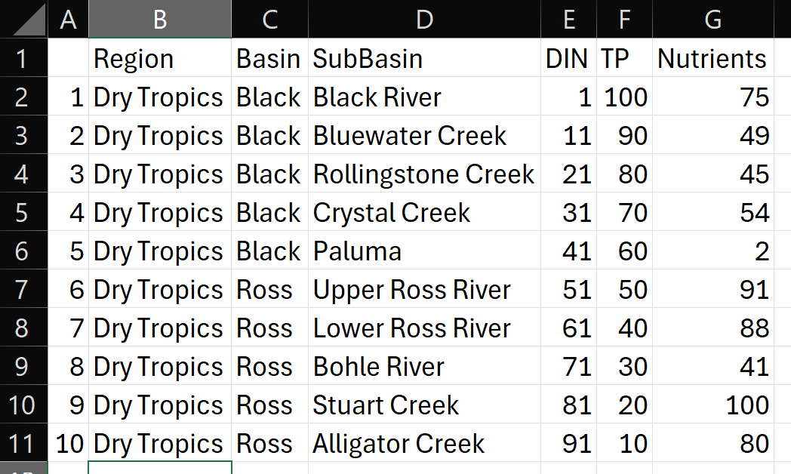
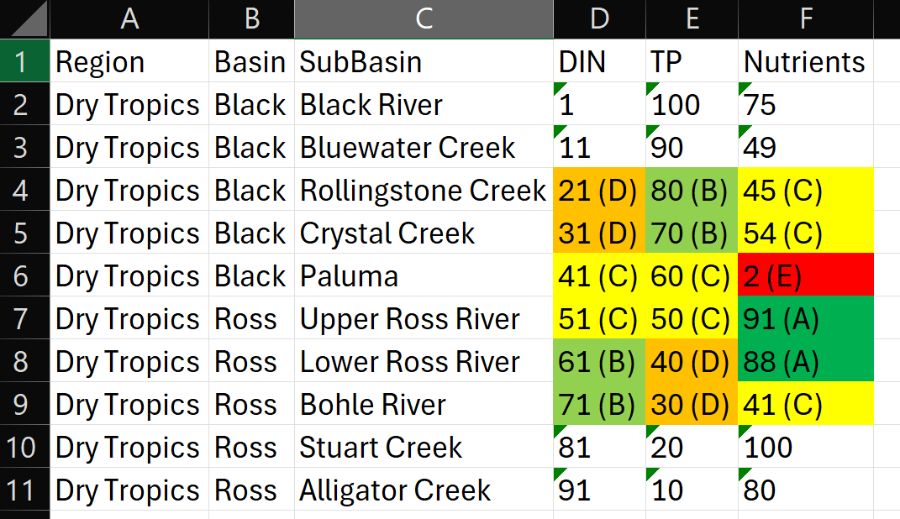

<!-- README.md is generated from README.Rmd. Please edit that file -->

# RcTools

<!-- badges: start -->

<!-- badges: end -->

The goal of RcTools is to provide a collection of tools (functions) to
be utilised by the Northern Three Report Cards’ technical staff. These
tools bridge the gap between R analysis and technical report writing,
and largely focus on producing xlsx files that are pre-formatted ready
to be inserted into the technical report.

## Installation

You can install the development version of RcTools from
[GitHub](https://github.com/) with:

``` r
# install.packages("pak")
pak::pak("add-am/RcTools")
```

## Example

This is a basic example which shows you how to solve a common problem:

The before and after of the above function is as follows:

<figure>

<figcaption aria-hidden="true">Before Formatting</figcaption>
</figure>

<figure>

<figcaption aria-hidden="true">After Formatting</figcaption>
</figure>
