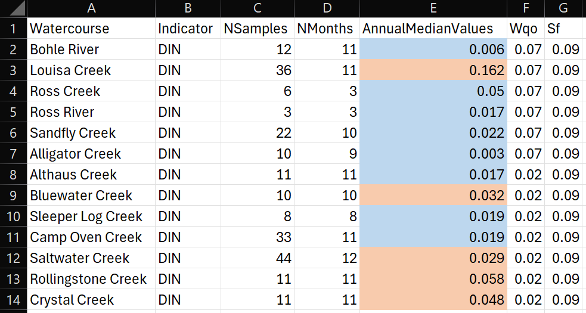

<!-- README.md is generated from README.Rmd. Please edit that file -->

# RcTools

<!-- badges: start -->

<!-- badges: end -->

The goal of RcTools is to provide a collection of tools (functions) to
be utilised by the Northern Three Report Cards’ technical staff. These
tools bridge the gap between R analysis and technical report writing,
and largely focus on producing xlsx files that are pre-formatted ready
to be inserted into the technical report.

## Installation

To install this package you will first need to download the [RTools
package](https://cran.r-project.org/bin/windows/Rtools/rtools45/rtools.html)
and install it on your computer (accept the defaults everywhere during
the installation process).

Following this, you can install the development version of RcTools from
[GitHub](https://github.com/) with:

``` r
# install.packages("pak")
pak::pak("add-am/RcTools")
```

## Usage

This package currently offers 1 key function, `save_n3_table()`, which
is designed to format data frames into a specific style that is used in
the Northern Three Report Cards. The function takes a data frame and
formats it according to the specifications of the report card, including
adding letter grades and adjusting the layout.

It has the following formatting options:

- Report Card (with or without letter grades): This colours cell from
  red to green based on the standard Report Card boundaries.
- Rainfall: This colours cells from brown to blue based on average
  rainfall codes (1 to 7).
- Temperature: This colours cells from blue to red based on average
  temperature codes (1 to 7).
- Summary Statistics: This compares mean/median values against WQOs and
  colours cells blue for pass and orange for fail.
- Presence Abesnce: This colours cells based on presence (blue) and
  absence (grey), used for fish observation data.

Below is a basic example of how to use the `save_n3_table()` function to
format a data frame for the Northern Three Report Card:

### Output

The output of the above function will be a .xlsx file with conditional
formatting applied, which will look similar to the following:

<figure>

<figcaption aria-hidden="true">After Report Card Formatting</figcaption>
</figure>

Equally, rainfall data looks like this:

<figure>

<figcaption aria-hidden="true">After Rainfall Formatting</figcaption>
</figure>

temperature data looks like this:

<figure>

<figcaption aria-hidden="true">After Temperature Formatting</figcaption>
</figure>

summary statistics data looks like this:

<figure>

<figcaption aria-hidden="true">After Summary Statistic
Formatting</figcaption>
</figure>

and presence absence data looks like this:

<figure>

<figcaption aria-hidden="true">After Presence Absence
Formatting</figcaption>
</figure>
