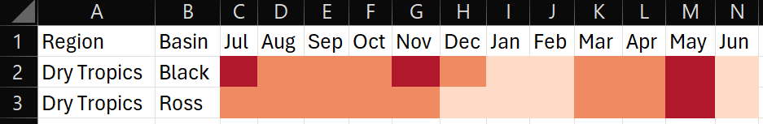

<!-- README.md is generated from README.Rmd. Please edit that file -->

``` r
knitr::opts_chunk$set(
  collapse = TRUE,
  comment = "#>",
  fig.path = "man/figures/README-",
  out.width = "100%"
)
```

# RcTools

<!-- badges: start -->

<!-- badges: end -->

The goal of RcTools is to provide a collection of tools (functions) to
be utilised by the Northern Three Report Cards’ technical staff. These
tools have been written to to bridge the gap between:

1.  Online data resources and desktop analysis, and
2.  Finish analysis products and N3 technical reports.

I.e., the tools focus on tasks such as downloading data, converting
values to scores, converting scores to grades, and producing stylised
visual products such as plots, maps, and formatted xlsx files.

## Installation

To install this package you will first need to download the [RTools
package](https://cran.r-project.org/bin/windows/Rtools/rtools45/rtools.html)
and install it on your computer (accept the defaults everywhere during
the installation process).

Following this, you can install the development version of RcTools from
[GitHub](https://github.com/) with:

``` r
# install.packages("pak")
pak::pak("add-am/RcTools")
```

Finally, load the package just like you would any other R package:

``` r
library(RcTools)
```

## Usage

This package currently contains 9 functions and is still expanding.
Functions can be grouped under two themes:

1.  eReefs related functions
2.  Data table related functions

Functions under each theme are explained below. Alternatively,
individual function documentation can be accessed with the command
`?function_name`.

### eReefs Functions

#### ereefs_extract

The `ereefs_extract` function takes a geometry input, date, and
variable, and returns a netCDF data object within those bounds.

``` r
#first a geometry object is loaded in using the sf package
sf_obj <- system.file("extdata/boundary.gpkg", package = "RcTools")
sf_obj <- sf::st_read(sf_obj)

#then the extract function can be run
nc <- ereefs_extract(
  Region = sf_obj, #define the region to look at with the sf object
  StartDate = "2022-03-01",
  EndDate = "2022-03-03",
  Variable = "Turbidity",
  Downsample = 0 #downsample reduces the size of the data by taking every nth cell
)
```

#### ereefs_reproject

The `ereefs_reproject` function takes a curvilinear netCDF object and
returns a regular grid netCDF object. The curvilinear netCDF object is
generally produced by the `ereefs_extract` function. Note, this function
tends to fail when the curvilinear netCDF object has a complex border,
such as at the edge of the Mackay Whitsunday Isaac region.

``` r
#reproject the data
nc <- ereefs_reproject(nc)
```

#### ereefs_dotplot

The `ereefs_dotplot` function takes a regular grid netCDF object and
returns a dotplot summarising daily values, the overall mean, and a
rolling average.

``` r
#plot data
p <- ereefs_plot(
  nc = nc,
  Heading = "Dry Tropics",
  YAxisName = "Chlorophyll a (mg/m3)",
  LogTransform = TRUE
)
```

The product of this function looks like this:

``` r
p
```

#### ereefs_windrose

The `ereefs_windplot` function takes a list regular grid netCDF objects
(specifically the four objects produced when requesting wind from the
`ereefs_extract` function) and returns a windrose plot summarising wind
strength and direction.

``` r
wr_p <- ereefs_windrose(
  nc = nc_2, 
  SubSample = 500, 
  Heading = "Approximated Wind Speed", 
  LegendTitle = "Speed (km/h)"
)
```

The product of this function looks like this:

``` r
wr_p
```

#### ereefs_map

The `ereefs_map` function takes either a singular regular grid netCDF
object, or a list regular grid netCDF objects and returns one of three
different map types. Map A) is a concentration map for data such as
turbidity, map B) is a true colour map that shows the “true” colour of
the water, and map C) is a vector field map that provides a spatial
representation of wind strength and direction.

Note that the visuals of true colour maps suffer from temporal
aggregation (instead short animations should be used).

``` r
m <- ereefs_map(
  nc = nc,
  MapType = "Concentration",
  Aggregation = "Month",
  LegendTitle = "Turbidity (NTU)",
  nrow = 2 #the number of rows to use if/when maps are facetted
)
```

The product of this function looks like this:

``` r
m
```

### Data Table Functions

#### value_to_score

The `value_to_score()` function is designed to calculate a variety of
report card scores used by the Northern Three Report Cards. The function
takes a dataframe and appends an additional column to the dataframe with
the calculated scores.

Currently this function can score the following indices/indicators:

- All water quality indicators (freshwater, estuarine, and marine
  environments)
- Mangroves and saltmarsh
- Wetlands
- Riparian vegtation (freshwater and estuarine)
- Fish

Depending on the index/indicator a different amount of inputs are
requried. Below is a example of how to use the `value_to_score()`
function to calculate scores for water quality indicators in the
freshwater environment.

First you would need to have a table of data:

``` r
#load the package
library(RcTools)

#create an example dataframe
df <- data.frame(
  WQIndicator = c(rep("DIN", 3), rep("Low DO", 3)),
  WQObjective = c(rep(0.02, 3), rep(90, 3)),
  WQScalingFactor = c(rep(0.38, 3), rep(70, 3)),
  WQValue = c(0.002, 0.017, 0.029, 65, 93, 101)
)

#calculate the twentieth and eightieth percentile values
df <- df |> 
  dplyr::mutate(
    WQEightieth = quantile(WQValue, probs = 0.8),
    WQTwentieth = quantile(WQValue, probs = 0.2)
  )
```

Then you can call the function just like any other tidyverse function.
Importantly, this function has been written to be “pipe-friendly”
i.e. you can use the function by itself, or in a pipe. That is to say
that `value_to_score(df, ...)` is the same as
`df |> value_to_score(...)`:

``` r
#run the scoring function
df <- df |> 
  value_to_score(
    value = WQValue,
    value_type = "Water Quality",
    water_type = "Freshwater",
    indicator = WQIndicator,
    wqo = WQObjective,
    sf = WQScalingFactor,
    eightieth = WQEightieth,
    twentieth = WQTwentieth
  )
```

Note that the arguments that are **not** provided in quotes are flexible
(i.e. they can be provided with or without quotes), this adheres to
tidyverse principles. However, the two arguments that **have** been
provided in quotes are not flexible - they must have quotes. These two
arguments are handled by the function internally a different way.

Another example of the same function used to score riparian vegetation
this time is as follows. Note that for this scoring method a lot less
information is required. Helpers will notify you when required
information is missing.

``` r
#create an example dataframe
df <- data.frame(
  RiparianValue = c(1, 0, -0.1, -1, -3, -5)
)

#run the scoring function. As a demonstration, no pipe has been used this time.
df <- value_to_score(
        df = df,
        value = RiparianValue,
        value_type = "Riparian"
      )
```

In anycase, the output of the function is the original table, now with
an additional score column. The name of the score column is inherited
from the name of the value column + “Score” added to the end of it -
this provides an easy link back to the source of the scores. The example
table above would look like this:

| RiparianValue | RiparianValueScore |
|---------------|--------------------|
| 1             | 81.19              |
| 0             | 80.90              |
| -0.1          | 61.00              |
| -1            | 21.00              |
| -3            | 20.48              |
| -5            | 20.06              |

#### score_to_grade

The `score_to_grade()` function has been designed to directly follow the
`value_to_score()` function. It takes a dataframe (with scores) and
appends an additional column to the dataframe with the calculated
grades.

Currently this function will provide grades that adhere to the following
range:

- 81 to 100 = A
- 61 to 80 = B
- 41 to 60 = C
- 21 to 40 = D
- 0 to 20 = E

Broadly speaking, the majority of grades follow this range, should any
other range be required the function will be updated.

Below is a basic example of how to use the `score_to_grade()` function.
If for some reason you have multiple columns that contain scores,
multiple columns can also be provided:

``` r
#create an example dataframe (duplicate of above table)
df <- data.frame(
  RiparianValue = c(1, 0, -0.1, -1, -3, -5),
  RiparianValueScore = c(81.19, 80.90, 61.00, 21.00, 20.48, 20.06)
)

#run the grading function.
df <- score_to_grade(df, RiparianValueScore)
```

The final output would look like this:

| RiparianValue | RiparianValueScore | RiparianValueGrade |
|---------------|--------------------|--------------------|
| 1             | 81.19              | A                  |
| 0             | 80.90              | B                  |
| -0.1          | 61.00              | B                  |
| -1            | 21.00              | D                  |
| -3            | 20.48              | E                  |
| -5            | 20.06              | E                  |

#### save_n3_table

The `save_n3_table()` function is designed to take a finalised dataframe
from within R (such as the one above) and save it as an excel file with
formatting in the specific style used by the Northern Three Report
Cards. Below is a basic example of how to use the `save_n3_table()`
function to format a data frame for the Northern Three Report Card. We
will use the table that we just created above for this example.

In the first instance, we apply styling only to the score column:

``` r
#run the "save as n3 table" function
save_n3_table(
  df = df,
  file_name = "Riparian Scores and Grades", 
  target_columns = 2, 
  target_rows = 1:nrow(df), 
  scheme = "Report Card",
  )
```

Which looks like this:


It is also possible to apply styling to the grade column as well.
However, a side effect of this is the score column inherits the grades
as well (as formatting is now done by character not value):

``` r
#run the "save as n3 table" function
save_n3_table(
  df = df,
  file_name = "Riparian Scores and Grades", 
  target_columns = 2:3, #note we expanded the column range
  target_rows = 1:nrow(df), 
  scheme = "Report Card", 
  include_letter = TRUE
  )
```

Which looks like this:


##### extensions

The `save_n3_table()` offers several other extensions for styling
choices, these are as follows:

- Report Card (with or without letter grades): This colours cell from
  red to green based on the standard Report Card boundaries.
  Demonstrated above.
- Rainfall: This colours cells from brown to blue based on average
  rainfall codes (1 to 7).
- Temperature: This colours cells from blue to red based on average
  temperature codes (1 to 7).
- Summary Statistics: This compares mean/median values against WQOs and
  colours cells blue for pass and orange for fail.
- Presence Absence: This colours cells based on presence (blue) and
  absence (grey), used for fish observation data.

Each of these extended styling options are implimented the same way,
with only the scheme argument changing. The other styling choices are as
follows:

Rainfall:


Temperature:



Summary statistics:


Presence absence:


