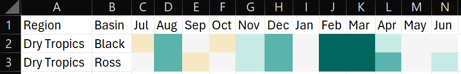
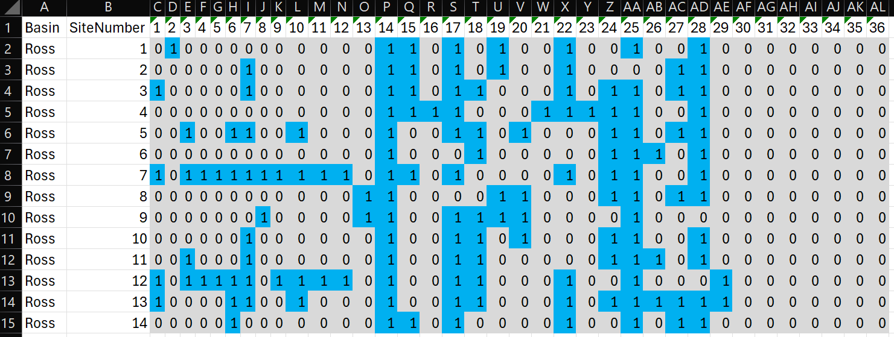

<!-- README.md is generated from README.Rmd. Please edit that file -->

# RcTools

<!-- badges: start -->

<!-- badges: end -->

The goal of RcTools is to provide a collection of tools (functions) to
be utilised by the Northern Three Report Cards’ technical staff. These
tools bridge the gap between R analysis and technical report writing,
and primarily focus on end of anaylsis pipelines such as converting
values to scores, score to grades, and dataframes into xlsx files that
are pre-formatted ready to be inserted into the technical report.

## Installation

To install this package you will first need to download the [RTools
package](https://cran.r-project.org/bin/windows/Rtools/rtools45/rtools.html)
and install it on your computer (accept the defaults everywhere during
the installation process).

Following this, you can install the development version of RcTools from
[GitHub](https://github.com/) with:

``` r
# install.packages("pak")
pak::pak("add-am/RcTools")
```

Finally, load the package just like you would any other R package:

``` r

library(RcTools)
```

## Usage

This package currently offers 3 key functions; `value_to_score`,
`score_to_grade`, and `save_n3_table()`. Each of these functions are
designed to work in sequence, starting from calculating report card
scores, and finishing with saving an .xslx table. A summary of each
function and an example use case is provided below.

### value_to_score

The `value_to_score` function is designed to calculate a variety of
report card scores used by the Northern Three Report Cards. The function
takes a dataframe and appends an additional column to the dataframe with
the calculated scores.

Currently this function can score the following indices/indicators:

- All water quality indicators (freshwater, estuarine, and marine
  environments)
- Mangroves and saltmarsh
- Wetlands
- Riparian vegtation (freshwater and estuarine)
- Fish

Depending on the index/indicator a different amount of inputs are
requried. Below is a basic example of how to use the `value_to_score()`
function to calculate scores:

``` r
#load the package
library(RcTools)

#create an example dataframe
df <- data.frame(
  WQIndicator = c(rep("DIN", 3), rep("Low DO", 3)),
  WQObjective = c(rep(0.02, 3), rep(90, 3)),
  WQScalingFactor = c(rep(0.38, 3), rep(70, 3)),
  WQValue = c(0.002, 0.017, 0.029, 65, 93, 101)
)

#calculate the twentieth and eightieth percentile values
df <- df |> 
  dplyr::mutate(
    WQEightieth = quantile(WQValue, probs = 0.8),
    WQTwentieth = quantile(WQValue, probs = 0.2)
  )

#run the scoring function
df <- df |> 
  value_to_score(
    value = WQValue,
    value_type = "Water Quality",
    water_type = "Freshwater",
    indicator = WQIndicator,
    wqo = WQObjective,
    sf = WQScalingFactor,
    eightieth = WQEightieth,
    twentieth = WQTwentieth
  )
```

The output of the function is the original table, now with an additional
score column. The example table above would look like this:

``` r

df
#> function (x, df1, df2, ncp, log = FALSE) 
#> {
#>     if (missing(ncp)) 
#>         .Call(C_df, x, df1, df2, log)
#>     else .Call(C_dnf, x, df1, df2, ncp, log)
#> }
#> <bytecode: 0x0000017b73c63238>
#> <environment: namespace:stats>
```

### score_to_grade

### save_n3_table

The `save_n3_table` is designed to format data frames into a specific
style that is used in the Northern Three Report Cards. The function
takes a data frame and formats it according to the specifications of the
report card, including adding letter grades and adjusting the layout.

It has the following formatting options:

- Report Card (with or without letter grades): This colours cell from
  red to green based on the standard Report Card boundaries.
- Rainfall: This colours cells from brown to blue based on average
  rainfall codes (1 to 7).
- Temperature: This colours cells from blue to red based on average
  temperature codes (1 to 7).
- Summary Statistics: This compares mean/median values against WQOs and
  colours cells blue for pass and orange for fail.
- Presence Absence: This colours cells based on presence (blue) and
  absence (grey), used for fish observation data.

Below is a basic example of how to use the `save_n3_table()` function to
format a data frame for the Northern Three Report Card:

``` r
#load the package
library(RcTools)

#create a basic dataset
df <- data.frame(
  "SubBasin" = c(
    "Black River", "Bluewater Creek", "Rollingstone Creek", "Crystal Creek", "Paluma",
    "Upper Ross River", "Lower Ross River", "Bohle River", "Stuart Creek", "Alligator Creek"
  ),
  "DIN" = c(seq(1, 100, 10)),
  "TP" = c(seq(100, 1, -10)),
  "Nutrients" = c(75, 49, 45, 54, 2, 91, 88, 41, 100, 80)
)

#run the "save as n3 table" function
save_n3_table(
  df = df, #select your data frame
  file_name = "output_file", #pick a name for your output file
  target_columns = 2:4, #specify which columns to format
  target_rows = 1:nrow(df), #specify which rows to format
  scheme = "Report Card", #define the formatting scheme
  include_letter = TRUE #decide if you want to include letter grades
  )
```

### Output

The output of the above function will be a .xlsx file with conditional
formatting applied, which will look similar to the following:


Equally, rainfall data looks like this:



temperature data looks like this:


summary statistics data looks like this:


and presence absence data looks like this:


